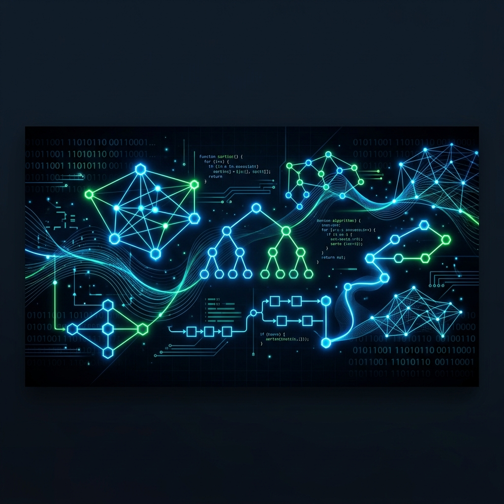

# 🚀 Data Structures & Algorithms Lab (C)

[](https://gcc.gnu.org/)
[](https://github.com/uttam102)
[]()
[](./LICENSE)

Welcome to the comprehensive repository for the **MScIT Semester 1 Data Structures Laboratory**. This repository contains industrial-grade implementations of fundamental data structures and algorithms, developed using C.

---

## 🗺️ Weekly Roadmap

| Milestone | Topics Covered | Key Implementation | Status |
| :--- | :--- | :--- | :--- |
| **Phase 1** | Foundations & Math | Simple Interest, Temp Converters | ✅ |
| **Phase 2** | Logic & Pattern | Patterns, Loop Mastery | ✅ |
| **Phase 3** | Arrays & Strings | Selection Sort, Manual String Ops | ✅ |
| **Phase 4** | Functions & pointers | Recursion, Pointer Arithmetic | ✅ |
| **Phase 5** | Memory & DS | Linked Lists, BST, Queues | ✅ |

---

## 📂 Detailed Syllabus & Breakdown

### 📘 WEEK 01: Programming Fundamentals
*Initial construction of logic using primitive types and basic operators.*
- `1.c`: Simple Interest Calculator (P*R*T/100)
- `2.c`: Bi-directional Temperature Converter (C ↔ F)
- `3.c`: Area & Perimeter (Circle/Rectangle)
- `4.c`: Operator Precedence Demonstration
- `5.c`: Swapping using Bitwise Operators
- `6.c`: Even/Odd Determination
- `7.c`: Grade Calculator (Ladder If-Else)
- `8.c`: Max of Three Numbers

### 📘 WEEK 02: Decision Control & Loops
*Mastering flow control and nested loops.*
- `1.c`: Menu-Driven Multi-function Calculator
- `2.c`: Leap Year Validation
- `3.c`: Multiplication Table Generator
- `4.c`: Geometric Pattern Printing
- `5.c`: Loop Mastery & Flow Control
- `6.c`: Prime Number Verification
- `7.c`: Sum of Digits & Reverse Logic
- `8.c`: Introduction to 1D Arrays

### 📘 WEEK 03: Sorting & Memory Efficiency
*Hands-on with data arrangement and manual string handling.*
- `1.c`: **Selection Sort** (Ascending/Descending)
- `2.c`: Linear Search Implementation
- `3.c`: Manual `strlen()` implementation
- `4.c`: Palindrome String Checker
- `5.c`: Basic Function Definitions
- `6.c`: Factorial implementation (Call by Value)
- `7.c`: Functional Prime Checker
- `8.c`: Swapping Logic (Call by Reference)

### 📘 WEEK 04: Advanced Functions & Pointers
*Bridging the gap between manual and automated memory access.*
- `1.c`: Modular Arithmetic Menu
- `2.c`: **Fibonacci Series** via Recursion
- `3.c`: Recursive Palindrome Check
- `4.c`: Integer Pointer Demonstration
- `5.c`: Pointer Arithmetic on Arrays
- `6.c`: Double Pointers (Pointer to Pointer)
- `7.c`: Array Reversal using Pointers
- `8.c`: Dynamic Memory Allocation (**malloc**)

### 📘 WEEK 05: Structures & DMA
*Organizing data using custom structures and dynamic heap memory.*
- `1.c`: Dynamic String Input Handling
- `2.c`: Student Record Structure
- `3.c`: Structure Array Management
- `4.c`: Pointer to Structure
- `5.c`: Nested Structures
- `6.c`: Union vs Structure Demonstration
- `7.c`: Enum Type implementation
- `8.c`: Memory Reallocation (**realloc**)

### 📘 WEEK 06: Array Manipulation
*Advanced operations on sequential data structures.*
- `1.c`: Dynamic Element Insertion
- `2.c`: Element Deletion & Resizing
- `3.c`: Splitting an Array
- `4.c`: Merging two Sorted Arrays
- `5.c`: Frequency Counting
- `6.c`: Finding Duplicates
- `7.c`: Array Intersection logic
- `8.c`: Union of two Arrays

### 📘 WEEK 07: Optimized Searching & Stacks
*Introduction to logarithmic search and LIFO principles.*
- `1.c`: **Binary Search** (Iterative vs Recursive)
- `2.c`: Stack implementation (Push/Pop/Peek)
- `3.c`: Linear Search vs Binary Search Comparison
- `4.c`: Stack Overflow/Underflow Handling
- `5.c`: Postfix Evaluation Prep
- `6.c`: Infix to Postfix logic
- `7.c`: Stack using Arrays
- `8.c`: Balanced Parentheses Verification

### 📘 WEEK 08: Queue Data Structure
*Implementing FIFO logic using circular and linear queues.*
- `1.c`: **Circular Queue** Implementation
- `2.c`: Linear Queue (Enqueue/Dequeue)
- `3.c`: Double Ended Queue (Deque)
- `4.c`: Priority Queue Basics
- `5.c`: Queue using Two Stacks
- `6.c`: Dynamic Queue Allocation
- `7.c`: Buffer Management
- `8.c`: Queue Display Logic

### 📘 WEEK 09: Linked Lists (Dynamic DS)
*Non-contiguous memory allocation using nodes.*
- `1.c`: **Singly Linked List** Operations
- `2.c`: SLL Insertion (Beginning/End/Pos)
- `3.c`: SLL Deletion logic
- `4.c`: List Reversal (Iterative)
- `5.c`: Circular Linked List
- `6.c`: Doubly Linked List Prep
- `7.c`: Finding Mid-node (Slow/Fast Pointers)
- `8.c`: List Concatenation

### 📘 WEEK 10: Hierarchical Data Structures
*Mastering non-linear storage using trees.*
- `1.c`: **Binary Search Tree** Construction
- `2.c`: BST Traversal (Inorder, Preorder, Postorder)
- `3.c`: Finding Min/Max in BST
- `4.c`: Node Deletion in BST
- `5.c`: Calculating Tree Height
- `6.c`: Leaf Node Counting
- `7.c`: Level Order Traversal
- `8.c`: Searching in BST

---

## 🛠️ Tech Stack & Requirements

- **Compiler**: GCC (MinGW for Windows)
- **Standard**: C99 / C11
- **Tools**: VS Code, GDB Debugger
- **Platform**: Cross-platform (Windows/Linux)

---

## 🚀 Installation & Usage

1. **Clone the Repo**
   ```bash
   git clone https://github.com/uttam102/DS-Lab.git
   cd DS-Lab
   ```

2. **Run a Program** (Example: Week 10 BST)
   ```bash
   cd WEEK10
   gcc 1.c -o solution
   ./solution
   ```

---

## 🤝 Contribution
Feel free to fork this project, improve the algorithms, or add documentation. Pull requests are always welcome!

---
*Maintained by [Uttam Kalsariya](https://github.com/uttam-kalsariya)*
